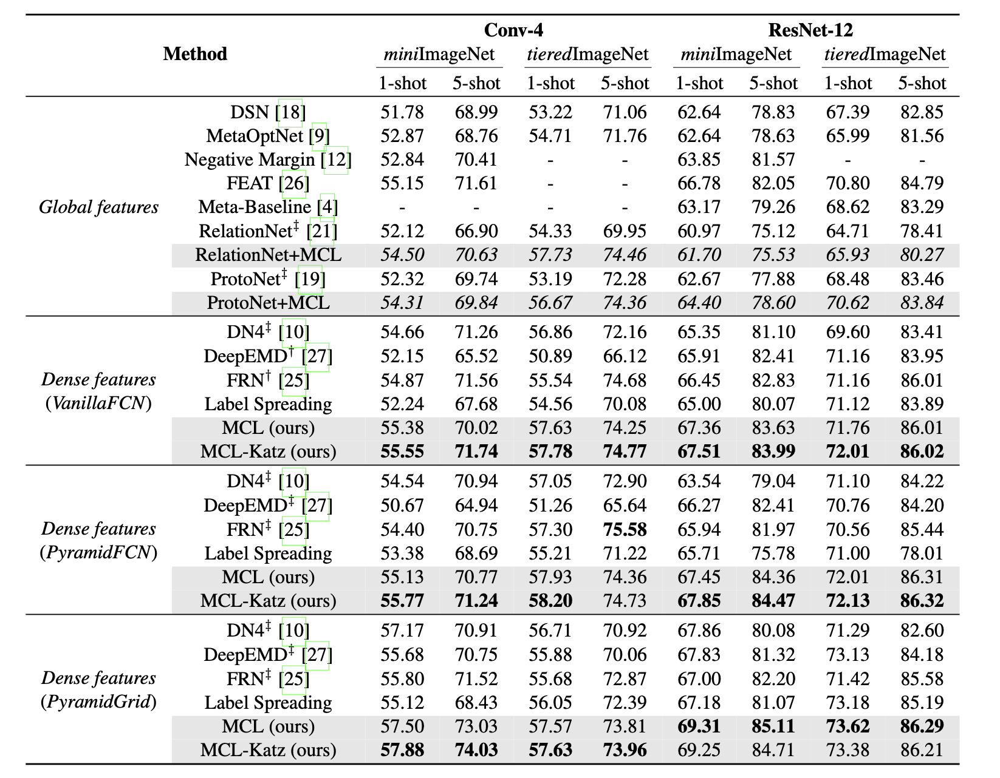
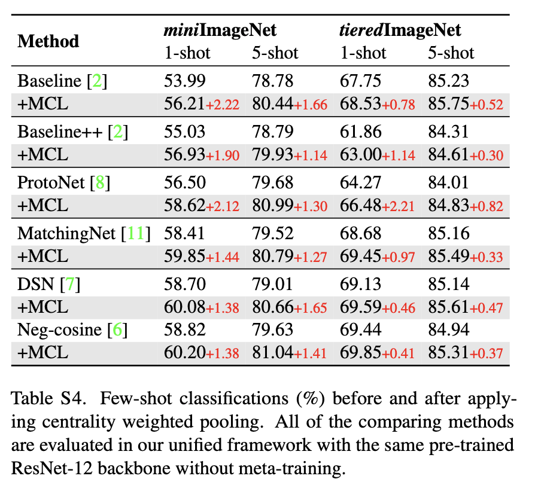

# Mutual Centralized Learning

This repository contains the public release of the Python implementation of

**Learning to Affiliate: Mutual Centralized Learning for Few-shot Classification (CVPR 2022)**

If you use this code or find this work useful for your research, please cite:

```
@InProceedings{Liu_2022_CVPR,
    author    = {Liu, Yang and Zhang, Weifeng and Xiang, Chao and Zheng, Tu and Cai, Deng and He, Xiaofei},
    title     = {Learning To Affiliate: Mutual Centralized Learning for Few-Shot Classification},
    booktitle = {Proceedings of the IEEE/CVF Conference on Computer Vision and Pattern Recognition (CVPR)},
    month     = {June},
    year      = {2022},
    pages     = {14411-14420}
}
```

## Overview


## Code Prerequisites

The following packages are required to run the scripts:

- [PyTorch >= version 1.4](https://pytorch.org)

- [tensorboard](https://www.tensorflow.org/tensorboard)

Some comparing methods may require additional packages to run (e.g, OpenCV in DeepEMD and qpth, cvxpy in MetaOptNet).

## Dataset prepare

The dataset should be placed in dir "./data/miniImagenet" (or "./data/tieredimagenet") with the following format:

```
MCL
├── data
│   ├── miniImagenet
│   │   ├── train
│   │   │   ├──n01532829
│   │   │   ├──────n0153282900000987.png
│   │   ├── val
│   │   │   ├──
│   │   │   ├──────
│   │   ├── test
│   │   │   ├── 
│   │   │   ├──────
```

The general mini-/tieredimagenet dataset can be downloaded from [DeepEMD](https://drive.google.com/drive/folders/1sXJgi9pXo8i3Jj1nk08Sxo6x7dAQjf9u?usp=sharing). The fine-grained datasets (i.e., CUB, meta-iNat and tiered meta-iNat) can be downloaded from [FRN](https://drive.google.com/drive/folders/1gHt-Ynku6Yc3mz6aKVTppIfNmzML1sNG).

## Train and test

The train/test configs, tensorboard log and saved checkpoints are saved in the following format:
```
Dataset_Method_NwayKshot_Backbone_Accuracy (e.g., miniImagenet_MEL_katz_N5K1_R12_67.509)
├── tensorboard_log_date
│   ├──events.out.tfevents
├── predictions.txt (evaluation acc)
├── config.yaml
├── ebest_Nway_Kshot.txt (validation best epoch .txt)
├── ebest_Nway_Kshot.pth (validation best epocg .pth)
```

Download the snapshot files from [Google Drive](https://drive.google.com/drive/folders/1MWRvIDLRhBB9lL0yfLg84Ynq532gR5P6?usp=sharing) and extract it into the `snapshots/` folder.

### Evaluate the meta-trained model

For example, MCL-Katz 5-way 1-shot ResNet12 VanillaFCN GPU 0
```
python experiments/run_evaluator.py \
  --cfg ./snapshots/ResNet-12/MEL_katz/VanillaFCN/miniImagenet_MEL_katz_N5K1_R12_67.509/MEL_katz_N5K1_R12.yaml \
  -c ./snapshots/ResNet-12/MEL_katz/VanillaFCN/miniImagenet_MEL_katz_N5K1_R12_67.509/ebest_5way_1shot.pth \
  --device 0
```

### Pretraining

We provide three pretraining config files motivated by [FRN](https://github.com/Tsingularity/FRN), DN4 and Linear Classifier. For example, FRN pretrainer on miniimagenet ResNet12 is performed by:
```
python experiments/run_pre.py \
  --cfg ./configs/miniImagenet/pretrainer/FRN_pre.yaml
  --device 0
```

The tensorboard log and pretrained model is saved in `snapshots/ResNet-12/pretrainer/`.

### Meta-training

For Conv-4 experiments, we directly train the model from scratch. Just select any of config files from `snapshots` folder to the `configs` directory, e.g.,
```
cp ./snapshots/Conv-4/MEL_katz/VanillaFCN/miniImagenet_MEL_katz_N5K1_Conv4_55.747/MEL_katz_N5K1_Conv4.yaml ./configs/miniImagenet/Conv-4/
sh ./fast_train_test.sh ./configs/miniImagenet/Conv-4/MEL_katz_N5K1_Conv4.yaml 0
```

For ResNet-12 experiments, we first select the config files by analogous: 
```
cp ./snapshots/ResNet-12/**/xxx.yaml ./configs/miniImagenet/ResNet-12/
```
Then we manually create the target checkpoint folders and copy (or soft link) the pretrained-model (e.g., `snapshots/ResNet-12/pretrainer/miniImagenet_FRN_pre/miniimagenet-e0_pre.pth`) to it:
```
mkdir ./checkpoint/xxx/
cp ./snapshots/ResNet-12/pretrainer/miniImagenet_FRN_pre/miniimagenet-e0_pre.pth ./checkpoint/xxx/
sh ./fast_train_test.sh ./configs/miniImagenet/ResNet-12/xxx.yaml 0
```
where `xxx` is the prefix of `.yaml` file and `0` indicates the GPU device number.

## Few-shot Classification Results

Experimental results on few-shot learning datasets with ResNet-12/Conv-4 backbone. We report average results with 10,000 randomly sampled episodes for both 1-shot and 5-shot evaluation.



## MCL Centrality Plugins without Meta-training

The centrality plugins experiments follow the pre-train + evaluation setting proposed in [Baseline](https://github.com/wyharveychen/CloserLookFewShot) that directly evaluates the methods without meta-training. We simply run `experiments/run_evaluator.py` on the pre-trained models that gives the following results:



## Acknowledgement

- Our pretraining codes and configs follow [FRN](https://github.com/Tsingularity/FRN)

- The dataset we used is from [DeepEMD](https://github.com/icoz69/DeepEMD)

## Start your own methods

We reimplement many of state-of-the-art methods in our unified framework according to their original implementations, *i.e.*, 
[DN4](https://github.com/WenbinLee/DN4), [DeepEMD](https://github.com/icoz69/DeepEMD), [FRN](https://github.com/Tsingularity/FRN), [DSN](https://github.com/chrysts/dsn_fewshot), [MetaOptNet](https://github.com/kjunelee/MetaOptNet), [R2D2](https://github.com/kjunelee/MetaOptNet), [CTX](https://github.com/lucidrains/cross-transformers-pytorch), [Baseline](https://github.com/wyharveychen/CloserLookFewShot), [Baseline++](https://github.com/wyharveychen/CloserLookFewShot), [NegativeMargin](https://github.com/bl0/negative-margin.few-shot), [ProtoNet](https://github.com/Sha-Lab/FEAT/blob/master/model/models/protonet.py), [RelationNet](https://github.com/floodsung/LearningToCompare_FSL), [MatchingNet](https://github.com/Sha-Lab/FEAT/blob/master/model/models/matchnet.py).

It is easy to implement your own method in our unified framework by adding the similar `your-own-method.py` in the directory `./modules/query/` like the others.

## Contact

We have tried our best to upload the correct snapshots on the google drive. However, since the config structures had been changed a lot in development (e.g., we introduce train/val/test n\_way k\_shot options instead of a single n_way k_shot in case some methods using the larger shot training), some of the `.yaml` configs in uploaded snapshots may have conflicts during loading.

If you encounter any issues or have questions about using the code, feel free to contact me [lyng\_95@zju.edu.cn](lyng\_95@zju.edu.cn)

