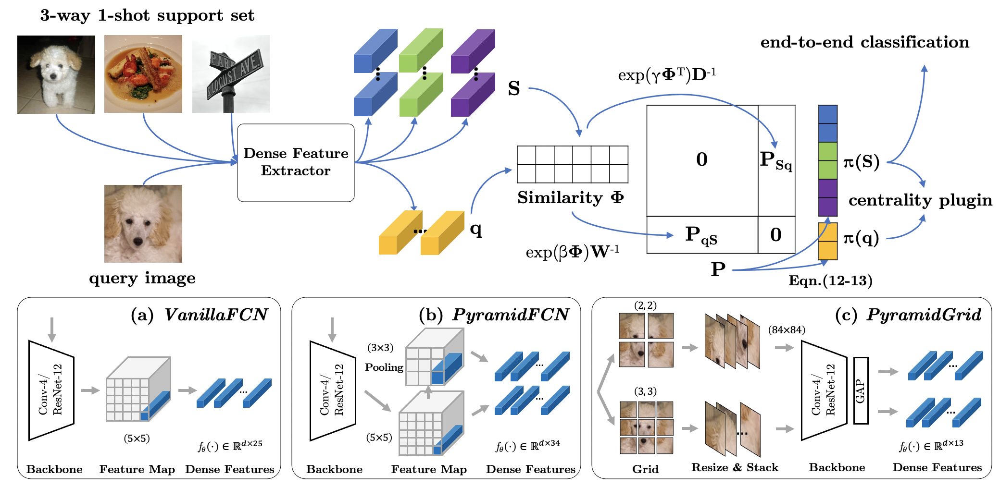

# Mutual Centralized Learning

This repository contains the public release of the Python implementation of

**Learning to Affiliate: Mutual Centralized Learning for Few-shot Classification**

If you use this code or find this work useful for your research, please cite:

```
@article{liu2021learning,
  title={Learning to Affiliate: Mutual Centralized Learning for Few-shot Classification},
  author={Liu, Yang and Zhang, Weifeng and Xiang, Chao and Zheng, Tu and Cai, Deng},
  journal={arXiv preprint arXiv:2106.05517},
  year={2021}
}
```

## Abstract

Few-shot learning (FSL) aims to learn a classifier that can be easily adapted to accommodate new tasks not seen during training, given only a few examples. To handle the limited-data problem in few-shot regimes, recent methods tend to collectively use a set of local features to densely represent an image instead of using a mixed global feature. They generally explore a unidirectional query-to-support paradigm in FSL, \eg, find the nearest/optimal support feature for each query feature and aggregate these local matches for a joint classification. In this paper, we propose a new method Mutual Centralized Learning (MCL) to fully affiliate the two disjoint sets of dense features in a bidirectional paradigm. We associate each local feature with a particle that can bidirectionally random walk in a discrete feature space by the affiliations. To estimate the class probability, we propose the features' accessibility that measures the expected number of visits to the support features of that class in a Markov process. We relate our method to learning a centrality on an affiliation network and demonstrate its capability to be plugged in existing methods by highlighting centralized local features. Experiments show that our method achieves the state-of-the-art on both *mini*ImageNet and *tiered*ImageNet.



## Code Prerequisites

The following packages are required to run the scripts:

- [PyTorch >= version 1.4](https://pytorch.org)

- [tensorboard](https://www.tensorflow.org/tensorboard)

## Dataset prepare

The miniImageNet and tieredImageNet data should be placed in dir "./data/miniImagenet" ("./data/tieredimagenet") with the following format:

```
MCL
├── data
│   ├── miniImagenet
│   │   ├── train
│   │   │   ├──n01532829
│   │   │   ├──────n0153282900000987.png
│   │   ├── val
│   │   │   ├──
│   │   │   ├──────
│   │   ├── test
│   │   │   ├── 
│   │   │   ├──────
```

The dataset can be downloaded from [Google Drive](https://drive.google.com/drive/folders/1sXJgi9pXo8i3Jj1nk08Sxo6x7dAQjf9u?usp=sharing)

## Train and test

The train/test configs, tensorboard log and saved checkpoints are saved in the following format:
```
Dataset_Method_NwayKshot_Backbone_Accuracy (e.g., miniImagenet_MEL_katz_N5K1_R12_67.509)
├── tensorboard_log_date
│   ├──events.out.tfevents
├── predictions.txt (evaluation acc)
├── config.yaml
├── ebest_Nway_Kshot.txt (validation best epoch .txt)
├── ebest_Nway_Kshot.pth (validation best epocg .pth)
```

Download the snapshot files from [Google Drive](https://drive.google.com/drive/folders/1MWRvIDLRhBB9lL0yfLg84Ynq532gR5P6?usp=sharing) and extract it into the `snapshots/` folder.

### Evaluate the meta-trained model

For example, MCL-Katz 5-way 1-shot ResNet12 VanillaFCN GPU 0
```
python experiments/run_evaluator.py \
  --cfg ./snapshots/ResNet-12/MEL_katz/VanillaFCN/miniImagenet_MEL_katz_N5K1_R12_67.509/MEL_katz_N5K1_R12.yaml \
  -c ./snapshots/ResNet-12/MEL_katz/VanillaFCN/miniImagenet_MEL_katz_N5K1_R12_67.509/ebest_5way_1shot.pth \
  --device 0
```

### Pretraining

We provide three pretraining config files motivated by [FRN](https://github.com/Tsingularity/FRN), DN4 and Linear Classifier. For example, FRN pretrainer on miniimagenet ResNet12 is performed by:
```
python experiments/run_pre.py \
  --cfg ./configs/miniImagenet/pretrainer/FRN_pre.yaml
  --device 0
```

The tensorboard log and pretrained model is saved in `snapshots/ResNet-12/pretrainer/`.

### Meta-training

For Conv-4 experiments, we directly train the model from scratch. Just select any of config files from `snapshots` folder to the `configs` directory, e.g.,
```
cp ./snapshots/Conv-4/MEL_katz/VanillaFCN/miniImagenet_MEL_katz_N5K1_Conv4_55.747/MEL_katz_N5K1_Conv4.yaml ./configs/miniImagenet/Conv-4/
sh ./fast_train_test.sh ./configs/miniImagenet/Conv-4/MEL_katz_N5K1_Conv4.yaml 0
```

For ResNet-12 experiments, we first select the config files by analogous: 
```
cp ./snapshots/ResNet-12/**/xxx.yaml ./configs/miniImagenet/ResNet-12/
```
Then we manually create the target checkpoint folders and copy (or soft link) the pretrained-model (e.g., `snapshots/ResNet-12/pretrainer/miniImagenet_FRN_pre/miniimagenet-e0_pre.pth`) to it:
```
mkdir ./checkpoint/xxx/
cp ./snapshots/ResNet-12/pretrainer/miniImagenet_FRN_pre/miniimagenet-e0_pre.pth ./checkpoint/xxx/
sh ./fast_train_test.sh ./configs/miniImagenet/ResNet-12/xxx.yaml 0
```
where `xxx` is the prefix of `.yaml` file and `0` indicates the GPU device number.

## Few-shot Classification Results

Experimental results on few-shot learning datasets with ResNet-12/Conv-4 backbone. We report average results with 10,000 randomly sampled episodes for both 1-shot and 5-shot evaluation.


## MCL Centrality Plugins


## Acknowledgement

- Our pretraining codes and configs follow [FRN](https://github.com/Tsingularity/FRN)

- The dataset we used is from [DeepEMD](https://github.com/icoz69/DeepEMD)

## Contact

We have tried our best to upload the correct snapshots on the google drive. However, since the config structures had been changed a lot in development (e.g., we introduce train/val/test n\_way k\_shot options instead of a single n_way k_shot in case some methods using the larger shot training), some of the `.yaml` configs in uploaded snapshots may have conflicts during loading.

If you encounter any issues or have questions about using the code, feel free to contact me [lyng\_95@zju.edu.cn](lyng\_95@zju.edu.cn)

