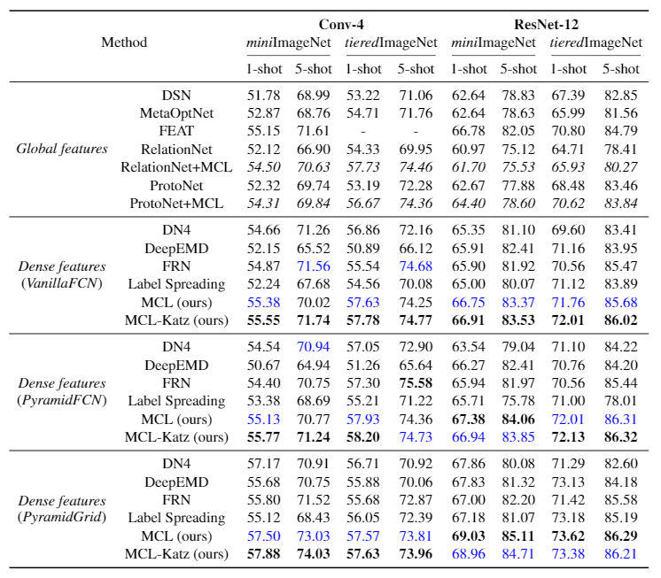

# Mutual Centralized Learning

This repository contains the public release of the Python implementation of

**Learning to Affiliate: Mutual Centralized Learning for Few-shot Classification**

If you use this code or find this work useful for your research, please cite:

```
@inproceedings{liu,
  title={},
  author={},
}
```

## Abstract

Few-shot learning (FSL) aims to learn a classifier that can be easily adapted to accommodate new tasks not seen during training, given only a few examples. To handle the limited-data problem in few-shot regimes, recent methods tend to collectively use a set of local features to densely represent an image instead of using a mixed global feature. They generally explore a unidirectional query-to-support paradigm in FSL, \eg, find the nearest/optimal support feature for each query feature and aggregate these local matches for a joint classification. In this paper, we propose a new method Mutual Centralized Learning (MCL) to fully affiliate the two disjoint sets of dense features in a bidirectional paradigm. We associate each local feature with a particle that can bidirectionally random walk in a discrete feature space by the affiliations. To estimate the class probability, we propose the features' accessibility that measures the expected number of visits to the support features of that class in a Markov process. We relate our method to learning a centrality on an affiliation network and demonstrate its capability to be plugged in existing methods by highlighting centralized local features. Experiments show that our method achieves the state-of-the-art on both *mini*ImageNet and *tiered*ImageNet.

## Few-shot Classification Results

Experimental results on few-shot learning datasets with ResNet-12/Conv-4 backbone. We report average results with 10,000 randomly sampled episodes for both 1-shot and 5-shot evaluation.



The configs, tensorboard snapshots and saved checkpoints can be downloaded from [Google Drive](https://drive.google.com/drive/folders/1MWRvIDLRhBB9lL0yfLg84Ynq532gR5P6?usp=sharing).

## Prerequisites

The following packages are required to run the scripts:

- [PyTorch >= version 1.4](https://pytorch.org)

- [tensorboard](https://www.tensorflow.org/tensorboard)

## Dataset prepare

The miniImageNet and tieredImageNet data should be placed in dir "./data/miniImagenet" ("./data/tieredimagenet") with the following format:

```
MCL
├── data
│   ├── miniImagenet
│   │   ├── train
│   │   │   ├──n01532829
│   │   │   ├──────n0153282900000987.png
│   │   ├── val
│   │   │   ├──
│   │   │   ├──────
│   │   ├── test
│   │   │   ├── 
│   │   │   ├──────
```

The dataset can be downloaded from [Google Drive](https://drive.google.com/drive/folders/1sXJgi9pXo8i3Jj1nk08Sxo6x7dAQjf9u?usp=sharing)

## Fast train&test with the provided configs

Example 1: MCL-Katz ResNet12 VanillaFCN GPU 0

```
sh ./fast_train_test.sh configs/miniImagenet/MEL_N5K1_R12_katz.yaml 0
```

Example 2: MCL ResNet12 PyramidGrid GPU 0

```
sh ./fast_train_test.sh configs/miniImagenet/MEL_N5K1_R12_Grids.yaml 0
```

